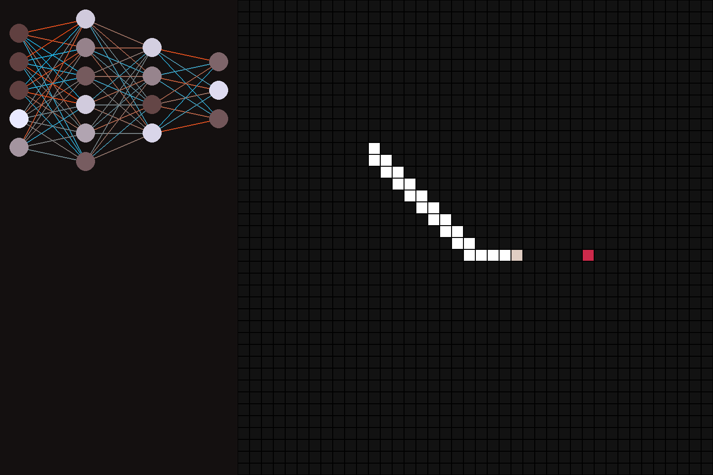

#### Snake
Learning how to create lite AI for the Snake.

To start run "App.py" file.

To change AI settings

#### Already have:
* Simple game with the snake and apples.
* Snake controlled by AI
* AI:
    * sees barrier in forward, left and right sides by one cell
    * knows direction to the apple
    * doesn't know how to avoid dead ends

#### Bug review:
* "apples" may spawn in the snake.
* You may also control snake,
but you need manually change option "self.RUNNING_AI" in App.py from 1 to 0

#### Planing:
- [X] Add some gif and pic for GitHub
- Add user interface with interactive:
  - [ ] Changing controller
  - [X] Neuron network graph
  - [ ] Stats of the game (apples collected, time, etc.)
- Expand the field of the snake's view:
  - [ ] Add more input neurons
  - [ ] Create mutetation system
  - [ ] Create artificial selection system

#### Pics:

__Snake with neurons visualization__

#### GIFs:

------------

